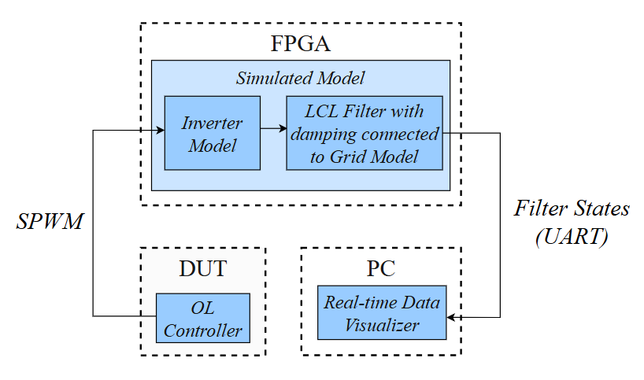
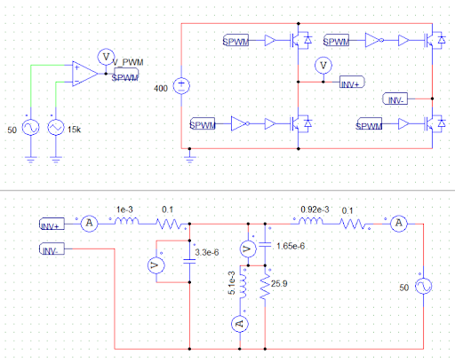
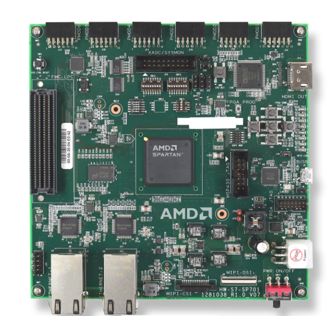

# FPGA-based Hardware-in-the-Loop (HIL) Simulation of Monophasic inverter with LCL Filter connected to Grid

Hardware-in-the-Loop (HIL) is a testing technique that integrates real physical components with real-time simulated models. This approach enables the validation of embedded systems, such as electronic controllers, under conditions close to reality, without the need to use the entire physical system.

This project aims to simulate in real time the behavior of a 2-level monophasic inverter connected to a low pass filter connected to grid. The PSIM model used as reference is shown below. PSIM's simulation was used as reference, and compared with real-time data.

It was developed in a FPGA from Xilinx-Spartan7 XC7S100. Its ports on the Top Level and constraints are board specific, but the inner system is inteded to be generic for any Xilinx board. 

This simulation could eventually be used to test and validate control algorithms. The current and voltage data from filter's capacitors and inductors could be use for closed loop control algorithms, but still need either an appropriate digital communication protol or analog output. Currently, it can send the states data through 3Mbps UART and 12bit PWM modulated signals through FPGAs PMOD ports. This PWM signal could be converted to analog data with a low-pass filter. On the image down below, it is possible to see current and voltage data on the osciloscope(with a low pass filter on the PWM modulated data) and the real-time python visualizer on the PC.

